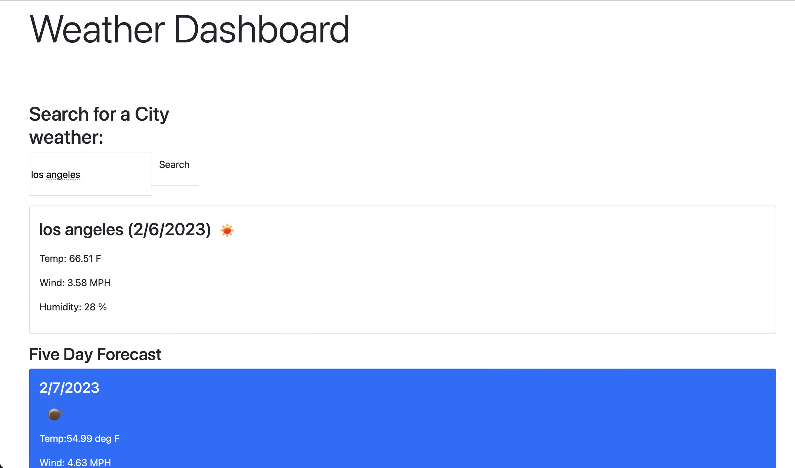

# Weather-Api.-
FullstackWeather

In this website application in fullstack develoment utalizing Weather Api. from open weather map the websites demonstrated functions are to store 
The Forcast

The National Weather Service (NWS) API allows developers access to critical forecasts, alerts, and observations, along with other weather data. The API was designed with a cache-friendly approach that expires content based upon the information life cycle.

